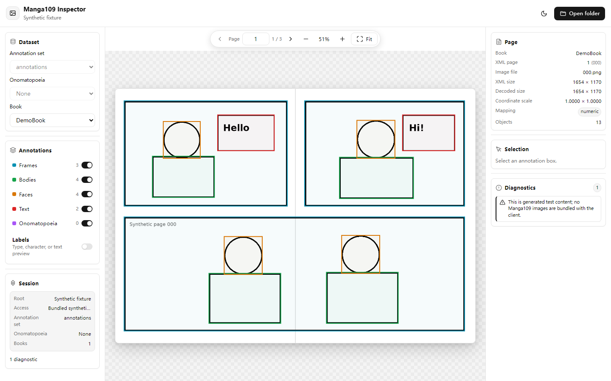

# Manga109 Inspector

A local-first PWA for viewing Manga109 and Manga109-s XML annotations overlaid on manga page images.
Tested on `manga109-s`.

**Live client:** https://yomikaco.github.io/manga109-inspector/



> [!IMPORTANT]
> This repository does not contain any Manga109 dataset. The bundled `DemoBook` is a synthetic fixture used only for testing. You must provide your own `images/` and `annotations/` folders.

## Features

- Open a local Manga109 folder and browse books and pages.
- Overlay frame, body, face, text, and onomatopoeia annotations on the page images.
- Choose a primary annotation set and optionally overlay `annotations_COO` onomatopoeia annotations.
- Toggle annotation layers, labels, zoom, and fit-to-view.

## Requirements

- Node.js 22 or later
- [pnpm](https://pnpm.io/)

## Quick start

```bash
pnpm install
pnpm run serve
```

Open `http://127.0.0.1:4173/` and select the root folder that contains your `images/` and `annotations/` directories.

## Dataset structure

```text
Manga109-root/
├─ images/
│  ├─ ARMS/
│  │  ├─ 000.jpg
│  │  └─ ...
│  └─ ...
├─ annotations/
│  ├─ ARMS.xml
│  └─ ...
└─ annotations_COO/           # optional onomatopoeia annotations
   ├─ ARMS.xml
   └─ ...
```

Versioned directories such as `annotations.v2021.12.30/` are also supported.

## Testing

```bash
pnpm run verify
```

This runs the type checker and the browser test suite.

## Dataset rights

The MIT license applies to the client and synthetic fixture only. Manga109 and Manga109-s have their own access, use, redistribution, and attribution terms. Review the official project terms before using or publishing dataset material.
